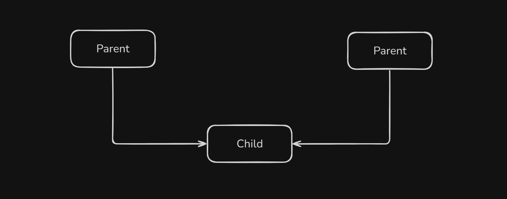
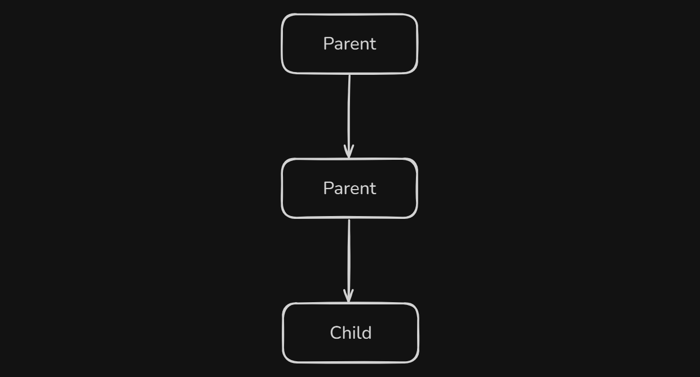
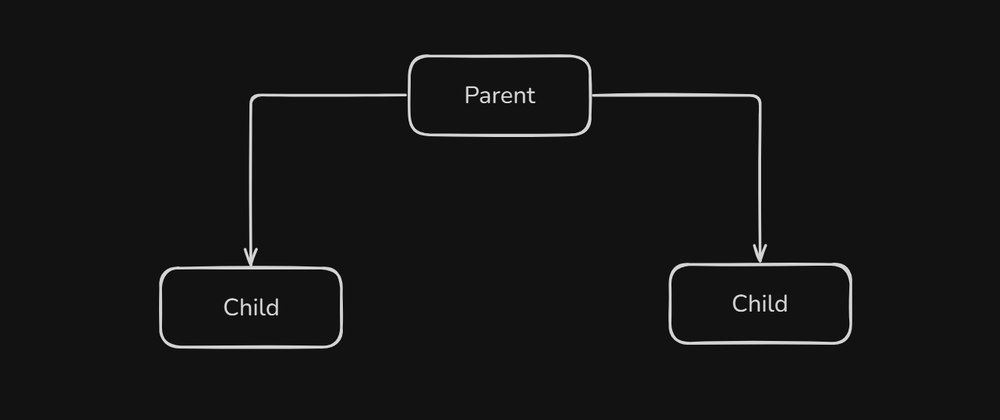
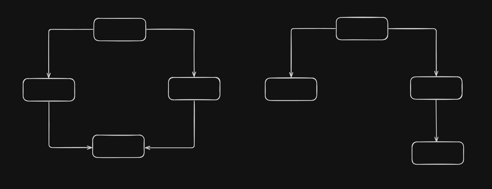

# Inheritance

Inheritance is a core concept of Object-Oriented Programming (OOP). It allows a class (child/derived class) to inherit properties and behaviors (data and functions) from another class (parent/base class).

- **Reusability**: Don’t repeat code — reuse existing logic.
- **Extensibility**: Easily add or modify features.
- **Organized hierarchy**: Build real-world relationships (e.g., Dog is an Animal).

#### Basic Syntax

```cpp
class Base {
  public:
    int a;
    void showA() {
        cout << "a = " << a << endl;
    }
};

class Derived : public Base {
  public:
    int b;
    void showB() {
        cout << "b = " << b << endl;
    }
};

```

#### Example

```cpp
#include <iostream>
using namespace std;

// Base class
class Animal {
  public:
    void eat() {
        cout << "This animal eats food." << endl;
    }
};

// Derived class
class Dog : public Animal {
  public:
    void bark() {
        cout << "Dog barks." << endl;
    }
};

int main() {
    Dog d;
    d.eat();   // Inherited from Animal
    d.bark();  // Dog's own method
    return 0;
}

```

## Access Specifiers in Inheritance (Mode of Inheritance)

| Base Class Specifier | Public Members in Derived | Protected Members | Private Members |
| -------------------- | ------------------------- | ----------------- | --------------- |
| `public`             | Public                    | Protected         | Not Inherited   |
| `protected`          | Protected                 | Protected         | Not Inherited   |
| `private`            | Private                   | Private           | Not Inherited   |

## Types of Inheritance

| Type             | Description                         | Syntax Example                                      |
| ---------------- | ----------------------------------- | --------------------------------------------------- |
| **Single**       | One base → one derived class        | `class B : public A {}`                             |
| **Multiple**     | Multiple base classes → one derived | `class C : public A, public B {}`                   |
| **Multilevel**   | Derived from a derived class        | `class C : public B {}`                             |
| **Hierarchical** | One base → multiple derived classes | `class B : public A {}` and `class C : public A {}` |
| **Hybrid**       | Combination of multiple types       | (May lead to Diamond Problem)                       |

### Single Inheritance

A derived class inherits from only one base class.

> In this type, one class derives from another single class.


```cpp
#include <iostream>
using namespace std;

class Animal {
  public:
    void sound() {
        cout << "Animal makes a sound." << endl;
    }
};

class Dog : public Animal {
  public:
    void bark() {
        cout << "Dog barks." << endl;
    }
};

int main() {
    Dog d;
    d.sound();
    d.bark();
    return 0;
}

```

### Multiple Inheritance

A derived class inherits from more than one base class.

> In this type, a class has multiple base classes and inherits features from all.



```cpp
#include <iostream>
using namespace std;

class Engine {
  public:
    void engineType() {
        cout << "Diesel engine." << endl;
    }
};

class Wheels {
  public:
    void wheelCount() {
        cout << "4 wheels." << endl;
    }
};

class Car : public Engine, public Wheels {
  public:
    void show() {
        cout << "This is a car." << endl;
    }
};

int main() {
    Car c;
    c.engineType();
    c.wheelCount();
    c.show();
    return 0;
}

```

### Multilevel Inheritance

A class is derived from a derived class.

> In this type, a class derives from a class which itself is a derived class.



```cpp
#include <iostream>
using namespace std;

class LivingBeing {
  public:
    void breathe() {
        cout << "Breathing..." << endl;
    }
};

class Animal : public LivingBeing {
  public:
    void move() {
        cout << "Animal moves." << endl;
    }
};

class Dog : public Animal {
  public:
    void bark() {
        cout << "Dog barks." << endl;
    }
};

int main() {
    Dog d;
    d.breathe();
    d.move();
    d.bark();
    return 0;
}

```

### Hierarchical Inheritance

Multiple derived classes inherit from a single base class.

> In this type, several classes inherit from a single base class.



```cpp
#include <iostream>
using namespace std;

class Shape {
  public:
    void draw() {
        cout << "Drawing shape..." << endl;
    }
};

class Circle : public Shape {
  public:
    void area() {
        cout << "Area of circle." << endl;
    }
};

class Rectangle : public Shape {
  public:
    void area() {
        cout << "Area of rectangle." << endl;
    }
};

int main() {
    Circle c;
    Rectangle r;

    c.draw();
    c.area();

    r.draw();
    r.area();

    return 0;
}

```

### Hybrid Inheritance

A combination of more than one type of inheritance.

> When two or more types of inheritance are combined, it is called hybrid inheritance. May cause diamond problem, solvable with virtual inheritance.



```cpp
#include <iostream>
using namespace std;

class A {
  public:
    void showA() {
        cout << "Class A" << endl;
    }
};

class B : public A {
  public:
    void showB() {
        cout << "Class B" << endl;
    }
};

class C : public A {
  public:
    void showC() {
        cout << "Class C" << endl;
    }
};

class D : public B, public C {
  public:
    void showD() {
        cout << "Class D" << endl;
    }
};

int main() {
    D d;
    // d.showA();  // Error: Ambiguous due to diamond problem
    d.showB();
    d.showC();
    d.showD();
    return 0;
}

```

> To resolve ambiguity, use virtual keyword in base classes.