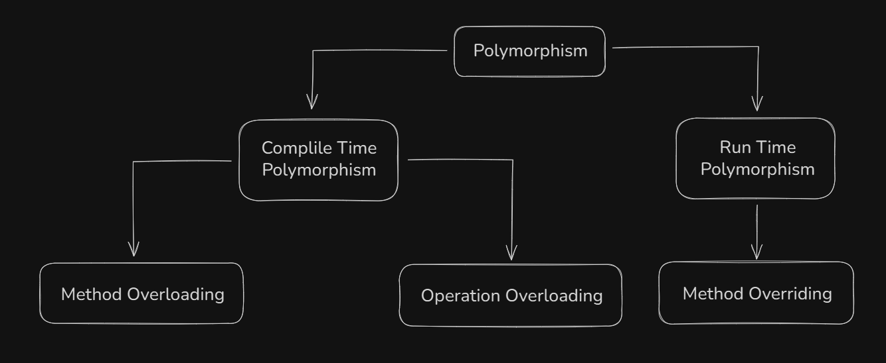

# Polymorphism

Polymorphism means "*many forms*". It allows objects of different classes to be treated as objects of a common superclass. It enables a single function, method, or operator to behave differently based on the object it is acting upon.

> Polymorphism is the ability of objects to take on different forms or behave in different ways depending on the context in which they are used.

## Types of polymorphism



### Compile-Time Polymorphism

Also known as early binding and static polymorphism, in compile-time polymorphism, the compiler determines how the function or operator will work depending on the context. This type of polymorphism is achieved by function overloading or operator overloading.

#### Method Overloading

Method overloading or Function overloading is a feature of object-oriented programming where two or more functions can have the same name but behave differently for different parameters. Such functions are said to be overloaded; hence, this is known as Function Overloading. Functions can be overloaded either by changing the number of arguments or changing the type of arguments.

```cpp
#include <bits/stdc++.h>
using namespace std;

class AdditionClass {
public:
    
    // Function to add two integers
    void add(int a, int b) {
        cout << "Integer Sum = " << a + b
        << endl;
    }
    
    // Function to add two floating point values
    void add(double a, double b) {
        cout << "Float Sum = " << a + b
        << endl ;
    }
};

int main() {
    AdditionClass obj;
    
    // add() called with int values
    obj.add(10, 2);

    // add() called with double value
    obj.add(5.3, 6.2);

    return 0;
}
```

> In the above example, two add() functions are defined with the same name but different parameter types: one for integers and one for floating-point numbers. The correct version of the add() function is called at compile time based on the type of arguments passed, allowing the same function name to be used for different data types.

#### Operator Overloading

C++ has the ability to provide the operators with a special meaning for particular data type, this ability is known as operator overloading. For example, we can make use of the addition operator `+` for string to concatenate two strings and for integer to add two integers. The `<<` and `>>` operator are binary shift operators but are also used with input and output streams. This is possible due to operator overloading.

```cpp
#include <iostream>
using namespace std;

class Complex {
public:
    int real, imag;
    
    Complex(int r, int i) :
    real(r), imag(i) {}

    // Overloading the '+' operator
    Complex operator+(const Complex& obj) {
        return Complex(real + obj.real,
        imag + obj.imag);
    }
};

int main() {
    Complex c1(10, 5), c2(2, 4);
    
    // Adding c1 and c2 using + operator
    Complex c3 = c1 + c2;  
    cout << c3.real << " + i" << c3.imag;
    return 0;
}
```

> Generally, operators like `+`, `-`, etc. does not work for user defined classes as they don't know what to do with them. Operator overloading allows us to define the behaviour of such operators for user defined data types like we did in this program with Complex class.

### Runtime Polymorphism

Also known as late binding and dynamic polymorphism, the function call in runtime polymorphism is resolved at runtime in contrast with compile time polymorphism, where the compiler determines which function call to bind at compilation. Runtime polymorphism is implemented using function overriding with virtual functions.

#### Method Overriding

Method Overriding or Function Overriding occurs when a derived class defines one or more member functions of the base class. That base function is said to be overridden. The base class function must be declared as virtual function for runtime polymorphism to happen.

```cpp
#include <bits/stdc++.h>
using namespace std;

class Base {
public:

    // Virtual function
    virtual void display() {
        cout << "Base class function";
    }
};

class Derived : public Base {
public:

    // Overriding the base class function
    void display() override {
        cout << "Derived class function";
    }
};

int main() {
    
    // Creating a pointer of type Base
    Base* basePtr;
    
    // Creating an object of Derived class
    Derived derivedObj;

    // Pointing base class pointer to 
    // derived class object
    basePtr = &derivedObj;
    
    // Calling the display function 
    // using base class pointer
    basePtr->display();
    return 0;
}
```

> In the above example, a virtual function display() is defined in the base class Base, and it is overridden in the derived class Derived. The Base class pointer basePtr points to an object of the Derived class. When the display() function is called using the basePtr, the derived class version of the display() function is called, and prints "Derived class function." This is possible because call is resolved at the runtime.

### Virtual Function

A virtual function in Cpp is a member function in a base class that you can override in a derived class, and when called through a base class pointer or reference, the derived class version is executed (not the base one).

#### Why to use Virtual Function

- To achieve runtime polymorphism
- To ensure correct method is called when using base class pointer
- To allow flexibility and extensibility in design

#### Features of Virtual Function

| Feature                  | Description                                                             |
| ------------------------ | ----------------------------------------------------------------------- |
| Purpose                  | Enables **runtime polymorphism** (late binding)                         |
| Declared with            | `virtual` keyword in base class                                         |
| Works with               | Base class **pointer/reference** pointing to derived class object       |
| Default binding behavior | Changes from **compile-time (static)** to **runtime (dynamic)** binding |

#### Virtual Function Rules

| Rule                                                | Explanation                            |
| --------------------------------------------------- | -------------------------------------- |
| Only works through **pointers/references**          | `Base*`, not `Base obj = Derived()`    |
| Use `override` in derived class (optional but good) | Makes code clearer and safer           |
| Destructors should be `virtual`                     | Ensures derived destructors are called |
| Can be **pure virtual** (`= 0`)                     | Makes the class abstract (no objects)  |

#### Example

```cpp
class Base {
  public:
    virtual void show() {
        cout << "Base class show()" << endl;
    }
};

class Derived : public Base {
  public:
    void show() override {
        cout << "Derived class show()" << endl;
    }
};

int main() {
    Base* ptr;
    Derived d;
    ptr = &d;

    ptr->show();  // Output: Derived class show()
    return 0;
}

```

> Without the `virtual` keyword, this would call `Base::show()` instead of `Derived::show()`.

#### Virtual Destructors

```cpp
class Base {
  public:
    virtual void show() {
        cout << "Base class show()" << endl;
    }
};

class Derived : public Base {
  public:
    void show() override {
        cout << "Derived class show()" << endl;
    }
};

int main() {
    Base* ptr;
    Derived d;
    ptr = &d;

    ptr->show();  // Output: Derived class show()
    return 0;
}

```

> If `~Base()` isn't virtual, only `Base` destructor will run — leading to memory leaks!

## Difference Between Compile Time And Run Time Polymorphism

| Compile-Time Polymorphism                                                                 | Run-Time Polymorphism                                                                 |
|--------------------------------------------------------------------------------------------|----------------------------------------------------------------------------------------|
| It is also called Static Polymorphism.                                                     | It is also known as Dynamic Polymorphism.                                              |
| The compiler determines which function or operation to call based on arguments.            | The decision of which function to call is determined at runtime based on the object.   |
| Function calls are statically binded.                                                      | Function calls are dynamically binded.                                                 |
| Can be exhibited by:<br>1. Function Overloading<br>2. Operator Overloading                 | Exhibited by Function Overriding                                                       |
| Faster execution rate.                                                                     | Comparatively slower execution rate.                                                   |
| Inheritance is not involved.                                                               | Involves inheritance.                                                                  |

