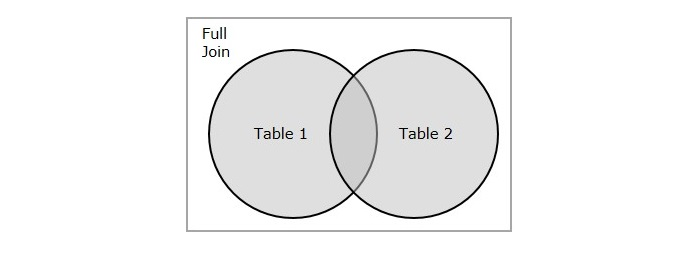

# SQL

It’s the standard language used to communicate with databases — mainly to store, retrieve, update, and delete data.

### Some basic things you can do with SQL:

- `SELECT` — get data from a database
- `INSERT` — add new data
- `UPDATE` — modify existing data
- `DELETE` — remove data
- `CREATE` — make new tables or databases
- `ALTER` — change structure of a table

## Using SQL in Your Web Site

To build a web site that shows data from a database, you will need:

- An RDBMS database program (i.e. MS Access, SQL Server, MySQL)
- To use a server-side scripting language, like PHP or ASP
- To use SQL to get the data you want
- To use HTML / CSS to style the page

## RDBMS

- RDBMS stands for Relational Database Management System.
- RDBMS is the basis for SQL, and for all modern database systems such as MS SQL Server, IBM DB2, Oracle, MySQL, and Microsoft Access.
- The data in RDBMS is stored in database objects called tables. A table is a collection of related data entries and it consists of columns and rows.

# SQL SELECT Statement

The `SELECT` statement is used to select data from a database.

```sql
SELECT column1, column2, ...
FROM table_name;
```

> Here, `column1`, `column2`, ... are the field names of the table you want to select data from. <br> The `table_name` represents the name of the table you want to select data from.

Example:

```sql
SELECT CustomerName, City FROM Customers;
```

If you want to return all columns, without specifying every column name, you can use the `SELECT *` syntax

```sql
SELECT * FROM Customers;
```

# SQL SELECT DISTINCT Statement

The `SELECT DISTINCT` statement is used to return only distinct (different) values.

```sql
SELECT DISTINCT column1, column2, ...
FROM table_name;
```

Example:

```sql
SELECT DISTINCT Country FROM Customers;
```

# SQL WHERE Clause

The `WHERE` clause is used to filter records.

It is used to extract only those records that fulfill a specified condition.

```sql
SELECT column1, column2, ...
FROM table_name
WHERE condition;
```

Example:

```sql
SELECT * FROM Customers
WHERE Country='India';
```

SQL requires single quotes around text values.
However, numeric fields should not be enclosed in quotes:

```sql
SELECT * FROM Customers
WHERE CustomerID=1;
```

## Operators in the WHERE Clause

| Operator | Description |
|----------|-------------|
| =        | Equal        |
| >        | Greater than |
| <        | Less than    |
| >=       | Greater than or equal |
| <=       | Less than or equal |
| <>       | Not equal (sometimes written as !=) |
| BETWEEN  | Between a certain range |
| LIKE     | Search for a pattern |
| IN       | Specify multiple possible values for a column |

# SQL ORDER BY Keyword

The `ORDER BY` keyword is used to sort the result-set in ascending or descending order.

- `ASC` - To sort the records in ascending order (by default)
- `DESC` - To sort the records in descending order

```sql
SELECT column1, column2, ...
FROM table_name
ORDER BY column1, column2, ... ASC|DESC;
```

Example:

```sql
SELECT * FROM Products
ORDER BY Price;
```

## ORDER BY Several Columns

```sql
SELECT * FROM Customers
ORDER BY Country, CustomerName;
```

> The following SQL statement selects all customers from the "Customers" table, sorted by the "Country" and the "CustomerName" column. This means that it orders by Country, but if some rows have the same Country, it orders them by CustomerName

```sql
SELECT * FROM Customers
ORDER BY Country ASC, CustomerName DESC;
```

> This  SQL statement selects all customers from the "Customers" table, sorted ascending by the "Country" and descending by the "CustomerName" column

# SQL AND Operator

The `WHERE` clause can contain one or many `AND` operators.

```sql
SELECT column1, column2, ...
FROM table_name
WHERE condition1 AND condition2 AND condition3 ...;
```

Example:

```sql
SELECT *
FROM Customers
WHERE Country = 'India' AND CustomerName LIKE 'S%';
```

# SQL OR Operator

The `WHERE` clause can contain one or more `OR` operators.

```sql
SELECT column1, column2, ...
FROM table_name
WHERE condition1 OR condition2 OR condition3 ...;
```

Example:

```sql
SELECT * FROM Customers
WHERE City = 'Bhubaneswar' OR CustomerName LIKE 'S%' OR Country = 'India';
```

> The `AND` operator displays a record if all the conditions are TRUE. <br> The `OR` operator displays a record if any of the conditions are TRUE.

## Combining AND and OR

You can combine the `AND` and `OR` operators.

```sql
SELECT * FROM Customers
WHERE Country = 'India' AND (CustomerName LIKE 'S%' OR CustomerName LIKE 'A%');
```

> The following SQL statement selects all customers from India that starts with a "S" or an "A".

> Make sure you use parenthesis to get the correct result, Without parenthesis, the select statement will return all customers from India that starts with a "S", plus all customers that starts with an "A", regardless of the country value

# SQL NOT Operator

The `NOT` operator is used in combination with other operators to give the opposite result, also called the negative result.

```sql
SELECT column1, column2, ...
FROM table_name
WHERE NOT condition;
```

Example:

```sql
SELECT * FROM Customers
WHERE NOT Country = 'India';
```

# SQL INSERT INTO Statement

The `INSERT INTO` statement is used to insert new records in a table

It is possible to write the `INSERT INTO` statement in two ways:

1. Specify both the column names and the values to be inserted

```sql
INSERT INTO table_name (column1, column2, column3, ...)
VALUES (value1, value2, value3, ...);
```

2. If you are adding values for all the columns of the table, you do not need to specify the column names in the SQL query. However, make sure the order of the values is in the same order as the columns in the table. Here, the `INSERT INTO` syntax would be as follows

```sql
INSERT INTO table_name
VALUES (value1, value2, value3, ...);
```

### Demo Database

| CustomerID | CustomerName          | ContactName      | Address                        | City     | PostalCode | Country |
|------------|------------------------|------------------|--------------------------------|----------|------------|---------|
| 89         | White Clover Markets    | Karl Jablonski   | 305 - 14th Ave. S. Suite 3B    | Seattle  | 98128      | USA     |
| 90         | Wilman Kala             | Matti Karttunen  | Keskuskatu 45                  | Helsinki | 21240      | Finland |
| 91         | Wolski                  | Zbyszek          | ul. Filtrowa 68                | Walla    | 01-012     | Poland  |

### INSERT INTO Example

```sql
INSERT INTO Customers (CustomerName, ContactName, Address, City, PostalCode, Country)
VALUES ('Cardinal', 'Tom B. Erichsen', 'Skagen 21', 'Stavanger', '4006', 'Norway');
```

| CustomerID | CustomerName          | ContactName      | Address                        | City     | PostalCode | Country |
|------------|------------------------|------------------|--------------------------------|----------|------------|---------|
| 89         | White Clover Markets    | Karl Jablonski   | 305 - 14th Ave. S. Suite 3B    | Seattle  | 98128      | USA     |
| 90         | Wilman Kala             | Matti Karttunen  | Keskuskatu 45                  | Helsinki | 21240      | Finland |
| 91         | Wolski                  | Zbyszek          | ul. Filtrowa 68                | Walla    | 01-012     | Poland  |
| 92         | Cardinal                | Tom B. Erichsen  | Skagen 21                      | Stavanger| 4006       | Norway  |

### Insert Data Only in Specified Columns

It is also possible to only insert data in specific columns.

The following SQL statement will insert a new record, but only insert data in the "CustomerName", "City", and "Country" columns (CustomerID will be updated automatically)

```sql
INSERT INTO Customers (CustomerName, City, Country)
VALUES ('Cardinal', 'Stavanger', 'Norway');
```

| CustomerID | CustomerName          | ContactName      | Address                        | City      | PostalCode | Country |
|------------|------------------------|------------------|--------------------------------|-----------|------------|---------|
| 89         | White Clover Markets    | Karl Jablonski   | 305 - 14th Ave. S. Suite 3B    | Seattle   | 98128      | USA     |
| 90         | Wilman Kala             | Matti Karttunen  | Keskuskatu 45                  | Helsinki  | 21240      | Finland |
| 91         | Wolski                  | Zbyszek          | ul. Filtrowa 68                | Walla     | 01-012     | Poland  |
| 92         | Cardinal                | null             | null                           | Stavanger | null       | Norway  |


### Insert Multiple Rows

It is also possible to insert multiple rows in one statement.

To insert multiple rows of data, we use the same `INSERT INTO` statement, but with multiple values

```sql
INSERT INTO Customers (CustomerName, ContactName, Address, City, PostalCode, Country)
VALUES
('Cardinal', 'Tom B. Erichsen', 'Skagen 21', 'Stavanger', '4006', 'Norway'),
('Greasy Burger', 'Per Olsen', 'Gateveien 15', 'Sandnes', '4306', 'Norway'),
('Tasty Tee', 'Finn Egan', 'Streetroad 19B', 'Liverpool', 'L1 0AA', 'UK');
```

| CustomerID | CustomerName          | ContactName      | Address                     | City      | PostalCode | Country |
|------------|------------------------|------------------|------------------------------|-----------|------------|---------|
| 89         | White Clover Markets    | Karl Jablonski    | 305 - 14th Ave. S. Suite 3B  | Seattle   | 98128      | USA     |
| 90         | Wilman Kala             | Matti Karttunen   | Keskuskatu 45               | Helsinki  | 21240      | Finland |
| 91         | Wolski                  | Zbyszek           | ul. Filtrowa 68             | Walla     | 01-012     | Poland  |
| 92         | Cardinal                | Tom B. Erichsen   | Skagen 21                   | Stavanger | 4006       | Norway  |
| 93         | Greasy Burger           | Per Olsen         | Gateveien 15                | Sandnes   | 4306       | Norway  |
| 94         | Tasty Tee               | Finn Egan         | Streetroad 19B              | Liverpool | L1 0AA     | UK      |

# SQL NULL Values

A field with a `NULL` value is a field with no value.

If a field in a table is optional, it is possible to insert a new record or update a record without adding a value to this field. Then, the field will be saved with a NULL value.

A NULL value is different from a zero value or a field that contains spaces. A field with a NULL value is one that has been left blank during record creation.

## How to Test for NULL Values?

It is not possible to test for NULL values with comparison operators, such as `=`, `<`, or `<>`.

We will have to use the `IS NULL` and `IS NOT NULL` operators instead.

### IS NULL Syntax

```sql
SELECT column_names
FROM table_name
WHERE column_name IS NULL;
```

> The `IS NULL` operator is used to test for empty values (NULL values).

### IS NOT NULL Syntax

```sql
SELECT column_names
FROM table_name
WHERE column_name IS NOT NULL;
```

> The `IS NOT NULL` operator is used to test for non-empty values (NOT NULL values).

# SQL UPDATE Statement

The `UPDATE` statement is used to modify the existing records in a table.

```sql
UPDATE table_name
SET column1 = value1, column2 = value2, ...
WHERE condition;
```

### Demo Database

| CustomerID | CustomerName                    | ContactName        | Address                          | City        | PostalCode | Country |
|------------|----------------------------------|--------------------|----------------------------------|-------------|------------|---------|
| 1          | Alfreds Futterkiste              | Maria Anders       | Obere Str. 57                    | Berlin      | 12209      | Germany |
| 2          | Ana Trujillo Emparedados y helados| Ana Trujillo       | Avda. de la Constitución 2222    | México D.F. | 05021      | Mexico  |
| 3          | Antonio Moreno Taquería          | Antonio Moreno     | Mataderos 2312                   | México D.F. | 05023      | Mexico  |
| 4          | Around the Horn                  | Thomas Hardy       | 120 Hanover Sq.                  | London      | WA1 1DP    | UK      |
| 5          | Berglunds snabbköp                | Christina Berglund | Berguvsvägen 8                   | Luleå       | S-958 22   | Sweden  |

### 1. UPDATE Table Example

```sql
UPDATE Customers
SET ContactName = 'Alfred Schmidt', City= 'Frankfurt'
WHERE CustomerID = 1;
```

| CustomerID | CustomerName                    | ContactName        | Address                       | City        | PostalCode | Country |
|------------|----------------------------------|--------------------|-------------------------------|-------------|------------|---------|
| 1          | Alfreds Futterkiste              | Alfred Schmidt     | Obere Str. 57                 | Frankfurt   | 12209      | Germany |
| 2          | Ana Trujillo Emparedados y helados| Ana Trujillo       | Avda. de la Constitución 2222 | México D.F. | 05021      | Mexico  |
| 3          | Antonio Moreno Taquería          | Antonio Moreno     | Mataderos 2312                | México D.F. | 05023      | Mexico  |
| 4          | Around the Horn                  | Thomas Hardy       | 120 Hanover Sq.               | London      | WA1 1DP    | UK      |
| 5          | Berglunds snabbköp                | Christina Berglund | Berguvsvägen 8                | Luleå       | S-958 22   | Sweden  |

### 2. UPDATE Multiple Records

It is the WHERE clause that determines how many records will be updated.

```sql
UPDATE Customers
SET ContactName='Juan'
WHERE Country='Mexico';
```

| CustomerID | CustomerName                    | ContactName        | Address                       | City        | PostalCode | Country |
|------------|----------------------------------|--------------------|-------------------------------|-------------|------------|---------|
| 1          | Alfreds Futterkiste              | Alfred Schmidt     | Obere Str. 57                 | Frankfurt   | 12209      | Germany |
| 2          | Ana Trujillo Emparedados y helados| Juan               | Avda. de la Constitución 2222 | México D.F. | 05021      | Mexico  |
| 3          | Antonio Moreno Taquería          | Juan               | Mataderos 2312                | México D.F. | 05023      | Mexico  |
| 4          | Around the Horn                  | Thomas Hardy       | 120 Hanover Sq.               | London      | WA1 1DP    | UK      |
| 5          | Berglunds snabbköp                | Christina Berglund | Berguvsvägen 8                | Luleå       | S-958 22   | Sweden  |

### Update Warning !

Be careful when updating records. If you omit the `WHERE` clause, ALL records will be updated!

```sql
UPDATE Customers
SET ContactName='Juan';
```

| CustomerID | CustomerName                    | ContactName | Address                       | City        | PostalCode | Country |
|------------|----------------------------------|-------------|-------------------------------|-------------|------------|---------|
| 1          | Alfreds Futterkiste              | Juan        | Obere Str. 57                 | Frankfurt   | 12209      | Germany |
| 2          | Ana Trujillo Emparedados y helados| Juan        | Avda. de la Constitución 2222 | México D.F. | 05021      | Mexico  |
| 3          | Antonio Moreno Taquería          | Juan        | Mataderos 2312                | México D.F. | 05023      | Mexico  |
| 4          | Around the Horn                  | Juan        | 120 Hanover Sq.               | London      | WA1 1DP    | UK      |
| 5          | Berglunds snabbköp                | Juan        | Berguvsvägen 8                | Luleå       | S-958 22   | Sweden  |

# SQL DELETE Statement

The `DELETE` statement is used to delete existing records in a table.

```sql
DELETE FROM table_name WHERE condition;
```

**NOTE** - Be careful when deleting records in a table! Notice the WHERE clause in the DELETE statement. The WHERE clause specifies which record(s) should be deleted. If you omit the WHERE clause, all records in the table will be deleted!

## Delete All Records

It is possible to delete all rows in a table without deleting the table. This means that the table structure, attributes, and indexes will be intact

```sql
DELETE FROM table_name;
```

## Delete a Table

To delete the table completely, use the `DROP TABLE` statement

```sql
DROP TABLE table_name;
```

# SQL TOP, LIMIT, FETCH FIRST or ROWNUM Clause

The `SELECT TOP` clause is used to specify the number of records to return.

The `SELECT TOP` clause is useful on large tables with thousands of records. Returning a large number of records can impact performance.

```sql
SELECT TOP 3 * FROM table_name;
```

> Select only the first 3 records of the Customers table

**NOTE** - Not all database systems support the `SELECT TOP` clause. MySQL supports the `LIMIT` clause to select a limited number of records, while Oracle uses `FETCH FIRST n ROWS ONLY` and `ROWNUM`.

### SQL Server / MS Access Syntax:

```sql
SELECT TOP number|percent column_name(s)
FROM table_name
WHERE condition;
```

### MySQL Syntax:

```sql
SELECT column_name(s)
FROM table_name
WHERE condition
LIMIT number;
```

### Oracle 12 Syntax:

```sql
SELECT column_name(s)
FROM table_name
ORDER BY column_name(s)
FETCH FIRST number ROWS ONLY;
```

### Older Oracle Syntax:

```sql
SELECT column_name(s)
FROM table_name
WHERE ROWNUM <= number;
```

### Older Oracle Syntax (with ORDER BY):

```sql
SELECT *
FROM (SELECT column_name(s) FROM table_name ORDER BY column_name(s))
WHERE ROWNUM <= number;
```

### Examples:

The following SQL statement shows the equivalent example for MySQL

```sql
SELECT * FROM Customers
LIMIT 3;
```

The following SQL statement shows the equivalent example for Oracle

```sql
SELECT * FROM Customers
FETCH FIRST 3 ROWS ONLY;
```

### SQL TOP PERCENT Example

The following SQL statement selects the first 50% of the records from the "Customers" table (for SQL Server/MS Access)

```sql
SELECT TOP 50 PERCENT * FROM Customers;
```

The following SQL statement shows the equivalent example for Oracle

```sql
SELECT * FROM Customers
FETCH FIRST 50 PERCENT ROWS ONLY;
```

### Add a WHERE Clause and ORDERBY Keyword

```sql
SELECT TOP 3 * FROM Customers
WHERE Country='Germany';
```

```sql
SELECT TOP 3 * FROM Customers
ORDER BY CustomerName DESC;
```

# SQL Aggregate Functions

An aggregate function is a function that performs a calculation on a set of values, and returns a single value.

Aggregate functions are often used with the `GROUP BY` clause of the `SELECT` statement. The `GROUP BY` clause splits the result-set into groups of values and the aggregate function can be used to return a single value for each group.

The most commonly used SQL aggregate functions are:

- `MIN()` - returns the smallest value within the selected column
- `MAX()` - returns the largest value within the selected column
- `COUNT()` - returns the number of rows in a set
- `SUM()` - returns the total sum of a numerical column
- `AVG()` - returns the average value of a numerical column

Aggregate functions ignore null values (except for `COUNT()`).

# SQL MIN() and MAX() Functions

The `MIN()` function returns the smallest value of the selected column.

The `MAX()` function returns the largest value of the selected column.

```sql
SELECT MIN(column_name)
FROM table_name
WHERE condition;
```

```sql
SELECT MAX(column_name)
FROM table_name
WHERE condition;
```

## Set Column Name (Alias)

When you use `MIN()` or `MAX()`, the returned column will not have a descriptive name. To give the column a descriptive name, use the AS keyword

```sql
SELECT MIN(Price) AS SmallestPrice
FROM Products;
```

## Use with GROUP BY

Here we use the `MIN()` function and the GROUP BY clause, to return the smallest price for each category in the Products table

```sql
SELECT MIN(Price) AS SmallestPrice, CategoryID
FROM Products
GROUP BY CategoryID;
```

> You will learn more about the `GROUP BY` clause later

# SQL COUNT() Function

The `COUNT()` function returns the number of rows that matches a specified criterion.

```sql
SELECT COUNT(column_name)
FROM table_name
WHERE condition;
```

Example:

```sql
SELECT COUNT(ProductID)
FROM Products
WHERE Price > 20;
```

## Count Records

```sql
SELECT COUNT(*)
FROM Products;
```

## Ignore Duplicates

```sql
SELECT COUNT(DISTINCT Price)
FROM Products;
```

## Use an Alias

```sql
SELECT COUNT(*) AS [Number of records]
FROM Products;
```

## Use COUNT() with GROUP BY

```sql
SELECT COUNT(*) AS [Number of records], CategoryID
FROM Products
GROUP BY CategoryID;
```

> You will learn more about the `GROUP BY` clause later

# SQL SUM() Function

The `SUM()` function returns the total sum of a numeric column.

```sql
SELECT SUM(column_name)
FROM table_name
WHERE condition;
```

Example:

```sql
SELECT SUM(Quantity)
FROM OrderDetails;
```

## SUM() With an Expression

The parameter inside the `SUM()` function can also be an expression

```sql
SELECT SUM(Quantity * 10)
FROM OrderDetails;
```

# SQL AVG() Function

The `AVG()` function returns the average value of a numeric column.

```sql
SELECT AVG(column_name)
FROM table_name
WHERE condition;
```

> NULL values are ignored.

Example:

```sql
SELECT AVG(Price)
FROM Products
WHERE CategoryID = 1;
```

### Higher Than Average

To list all records with a higher price than average, we can use the `AVG()` function in a sub query

```sql
SELECT * FROM Products
WHERE price > (SELECT AVG(price) FROM Products);
```

**NOTE** - You can use `AS` Keyword (Alias) and `GROUP BY` Clause with `SUM()` and `AVG()`

# SQL LIKE Operator

The `LIKE` operator is used in a `WHERE` clause to search for a specified pattern in a column.

There are two wildcards often used in conjunction with the `LIKE` operator:
- The percent sign `%` represents zero, one, or multiple characters
- The underscore sign `_` represents one, single character

```sql
SELECT column1, column2, ...
FROM table_name
WHERE columnN LIKE pattern;
```

## The _ Wildcard

The `_` wildcard represents a single character.

It can be any character or number, but each `_` represents one, and only one, character.

```sql
SELECT * FROM Customers
WHERE city LIKE 'B_rl__';
```

> Return all customers from a city that starts with 'B' followed by one wildcard character, then 'rl' and then two wildcard characters

## The % Wildcard

The `%` wildcard represents any number of characters, even zero characters.

```sql
SELECT * FROM Customers
WHERE city LIKE '%L%';
```

> Return all customers from a city that contains the letter 'L'

**Starts With** - To return records that starts with a specific letter or phrase, add the `%` at the end of the letter or phrase

**Ends With** - To return records that ends with a specific letter or phrase, add the % at the beginning of the letter or phrase

**Note** - Any wildcard, like `%` and `_` , can be used in combination with other wildcards

## More Wildcards

| Symbol | Description                                      | Example                                                                 |
|--------|--------------------------------------------------|-------------------------------------------------------------------------|
| `*`    | Represents zero or more characters               | `bl*` finds `bl`, `black`, `blue`, and `blob`                           |
| `?`    | Represents a single character                    | `h?t` finds `hot`, `hat`, and `hit`                                     |
| `[]`   | Represents any single character within the brackets | `h[oa]t` finds `hot` and `hat`, but not `hit`                        |
| `!`    | Represents any character not in the brackets     | `h[!oa]t` finds `hit`, but not `hot` and `hat`                          |
| `-`    | Represents any single character within the specified range | `c[a-b]t` finds `cat` and `cbt`                              |
| `#`    | Represents any single numeric character          | `2#5` finds `205`, `215`, `225`, `235`, `245`, `255`, `265`, `275`, `285`, and `295` |

> In SQL, both `%` and `*` are wildcard or special characters, but they are used in different contexts and have different purposes <br>  `%` — Wildcard in `LIKE` queries <br> `*` — Select all columns

# SQL IN Operator

The `IN` operator allows you to specify multiple values in a `WHERE` clause.

The `IN` operator is a shorthand for multiple `OR` conditions.

```sql
SELECT column_name(s)
FROM table_name
WHERE column_name IN (value1, value2, ...);
```

Example:

```sql
SELECT * FROM Customers
WHERE Country IN ('Germany', 'France', 'UK');
```

## NOT IN

By using the `NOT` keyword in front of the `IN` operator, you return all records that are NOT any of the values in the list

```sql
SELECT * FROM Customers
WHERE Country NOT IN ('Germany', 'France', 'UK');
```

> Return all customers that are NOT from 'Germany', 'France', or 'UK'

## IN (SELECT)

You can also use `IN` with a subquery in the `WHERE` clause.

With a subquery you can return all records from the main query that are present in the result of the subquery.

```sql
SELECT * FROM Customers
WHERE CustomerID IN (SELECT CustomerID FROM Orders);
```

> Return all customers that have an order in the Orders table

## NOT IN (SELECT)

You can also use `NOT IN` with a subquery in the `WHERE` clause.

With a subquery you can return all records from the main query that are not present in the result of the subquery.

```sql
SELECT * FROM Customers
WHERE CustomerID NOT IN (SELECT CustomerID FROM Orders);
```

> Return all customers that have NOT placed any orders in the Orders table

# SQL BETWEEN Operator

The `BETWEEN` operator selects values within a given range. The values can be numbers, text, or dates.

The `BETWEEN` operator is inclusive: begin and end values are included.

```sql
SELECT column_name(s)
FROM table_name
WHERE column_name BETWEEN value1 AND value2;
```

Example:

```sql
SELECT * FROM Products
WHERE Price BETWEEN 100 AND 200;
```

## NOT BETWEEN

To display the products outside the range of the previous example, use `NOT BETWEEN`

```sql
SELECT * FROM Products
WHERE Price NOT BETWEEN 100 AND 200;
```

## BETWEEN Text Values

The following SQL statement selects all products with a ProductName alphabetically between Carnarvon Tigers and Mozzarella di Giovanni:

```sql
SELECT * FROM Products
WHERE ProductName BETWEEN 'Carnarvon Tigers' AND 'Mozzarella di Giovanni'
ORDER BY ProductName;
```

## BETWEEN Dates

The following SQL statement selects all orders with an OrderDate between '01-July-1996' and '31-July-1996'

```sql
SELECT * FROM Orders
WHERE OrderDate BETWEEN #07/01/1996# AND #07/31/1996#;
```

# SQL Aliases

SQL aliases are used to give a table, or a column in a table, a temporary name.

Aliases are often used to make column names more readable.

An alias only exists for the duration of that query.

An alias is created with the `AS` keyword.

1. When alias is used on column:

```sql
SELECT column_name AS alias_name
FROM table_name;
```

2. When alias is used on table:
 
```sql
SELECT column_name(s)
FROM table_name AS alias_name;
```

Example:

```sql
SELECT CustomerID AS ID
FROM Customers;
```

```sql
SELECT CustomerID ID
FROM Customers;
```

> Actually, in most database languages, you can skip the AS keyword and get the same result (`AS` is optional)

## Using Aliases With a Space Character

Using [square brackets] for aliases with space characters:

```sql
SELECT ProductName AS [My Great Products]
FROM Products;
```

Using "double quotes" for aliases with space characters:

```sql
SELECT ProductName AS "My Great Products"
FROM Products;
```

**Note** - Some database systems allows both [] and "", and some only allows one of them.

## Concatenate Columns

The following SQL statement creates an alias named "Address" that combine four columns (Address, PostalCode, City and Country):

```sql
SELECT CustomerName, Address + ', ' + PostalCode + ' ' + City + ', ' + Country AS Address
FROM Customers;
```

### MySQL Example

```sql
SELECT CustomerName, CONCAT(Address,', ',PostalCode,', ',City,', ',Country) AS Address
FROM Customers;
```

### Oracle Example

```sql
SELECT CustomerName, (Address || ', ' || PostalCode || ' ' || City || ', ' || Country) AS Address
FROM Customers;
```

# SQL Joins

A `JOIN` clause is used to combine rows from two or more tables, based on a related column between them.

Example:

Let's look at a selection from the "Orders" table:

| OrderID | CustomerID | OrderDate   |
|---------|-------------|-------------|
| 10308   | 2           | 1996-09-18  |
| 10309   | 37          | 1996-09-19  |
| 10310   | 77          | 1996-09-20  |

Then, look at a selection from the "Customers" table:

| CustomerID | CustomerName                    | ContactName      | Country |
|------------|----------------------------------|------------------|---------|
| 1          | Alfreds Futterkiste              | Maria Anders     | Germany |
| 2          | Ana Trujillo Emparedados y helados| Ana Trujillo     | Mexico  |
| 3          | Antonio Moreno Taquería          | Antonio Moreno   | Mexico  |

> Notice that the "CustomerID" column in the "Orders" table refers to the "CustomerID" in the "Customers" table. The relationship between the two tables above is the "CustomerID" column.

Then, we can create the following SQL statement (that contains an `INNER JOIN`), that selects records that have matching values in both tables:


```sql
SELECT Orders.OrderID, Customers.CustomerName, Orders.OrderDate
FROM Orders
INNER JOIN Customers ON Orders.CustomerID=Customers.CustomerID;
```

and it will produce something like this

| OrderID | CustomerName                    | OrderDate  |
|---------|----------------------------------|------------|
| 10308   | Ana Trujillo Emparedados y helados | 9/18/1996  |
| 10365   | Antonio Moreno Taquería          | 11/27/1996 |
| 10383   | Around the Horn                  | 12/16/1996 |
| 10355   | Around the Horn                  | 11/15/1996 |
| 10278   | Berglunds snabbköp               | 8/12/1996  |

## Different Types of SQL JOINs

- **`(INNER) JOIN`**: Returns records that have matching values in both tables
- **`LEFT (OUTER) JOIN`**: Returns all records from the left table, and the matched records from the right table
- **`RIGHT (OUTER) JOIN`**: Returns all records from the right table, and the matched records from the left table
- **`FULL (OUTER) JOIN`**: Returns all records when there is a match in either left or right table

<div>
    
    
    
    
</div>

## SQL INNER JOIN

The `INNER JOIN` keyword selects records that have matching values in both tables.

```sql
SELECT column_name(s)
FROM table1
INNER JOIN table2
ON table1.column_name = table2.column_name;
```

> `JOIN `and `INNER JOIN` will return the same result. <br> `INNER` is the default join type for `JOIN`, so when you write `JOIN` the parser actually writes `INNER JOIN`


**Note** - The `INNER JOIN` keyword returns only rows with a match in both tables. Which means that if you have a product with no CategoryID, or with a CategoryID that is not present in the Categories table, that record would not be returned in the result

### JOIN Three Tables

Example:

```sql
SELECT Orders.OrderID, Customers.CustomerName, Shippers.ShipperName
FROM ((Orders
INNER JOIN Customers ON Orders.CustomerID = Customers.CustomerID)
INNER JOIN Shippers ON Orders.ShipperID = Shippers.ShipperID);
```

## SQL LEFT JOIN

The `LEFT JOIN` keyword returns all records from the left table (table1), and the matching records from the right table (table2). The result is 0 records from the right side, if there is no match.

```sql
SELECT column_name(s)
FROM table1
LEFT JOIN table2
ON table1.column_name = table2.column_name;
```

> In some databases `LEFT JOIN` is called `LEFT OUTER JOIN`.


## SQL RIGHT JOIN

The `RIGHT JOIN` keyword returns all records from the right table (table2), and the matching records from the left table (table1). The result is 0 records from the left side, if there is no match.

```sql
SELECT column_name(s)
FROM table1
RIGHT JOIN table2
ON table1.column_name = table2.column_name;
```

> In some databases `RIGHT JOIN` is called `RIGHT OUTER JOIN`.


## SQL FULL JOIN

The `FULL OUTER JOIN` keyword returns all records when there is a match in left (table1) or right (table2) table records.

```sql
SELECT column_name(s)
FROM table1
FULL OUTER JOIN table2
ON table1.column_name = table2.column_name
WHERE condition;
```

> `FULL OUTER JOIN` and `FULL JOIN` are the same.


## SQL SELF JOIN

A self join is a regular join, but the table is joined with itself

```sql
SELECT column_name(s)
FROM table1 T1, table1 T2
WHERE condition;
```

> T1 and T2 are different table aliases for the same table.

Example: 

```sql
SELECT A.CustomerName AS CustomerName1, B.CustomerName AS CustomerName2, A.City
FROM Customers A, Customers B
WHERE A.CustomerID <> B.CustomerID
AND A.City = B.City
ORDER BY A.City;
```

# SQL UNION Operator

The `UNION` operator is used to combine the result-set of two or more `SELECT` statements.

- Every `SELECT` statement within `UNION` must have the same number of columns
- The columns must also have similar data types
- The columns in every `SELECT` statement must also be in the same order

UNION Syntax:

```sql
SELECT column_name(s) FROM table1
UNION
SELECT column_name(s) FROM table2;
```

UNION ALL Syntax:

```sql
SELECT column_name(s) FROM table1
UNION ALL
SELECT column_name(s) FROM table2;
```

> The column names in the result-set are usually equal to the column names in the first SELECT statement.


# SQL INTERSECT Operator

The `INTERSECT` operator is used to combine the result-set of two `SELECT` statements and returns only the common rows between them.

- Every `SELECT` statement within `INTERSECT` must have the same number of columns
- The columns must also have similar data types
- The columns in every `SELECT` statement must also be in the same order

INTERSECT Syntax:

```sql
SELECT column_name(s) FROM table1
INTERSECT
SELECT column_name(s) FROM table2;
```

- **INTERSECT** returns only the rows that appear in both `SELECT` statements.
- **INTERSECT ALL** is not supported by all database systems, unlike `UNION ALL`.

# SQL GROUP BY Statement

The `GROUP BY` statement groups rows that have the same values into summary rows, like "find the number of customers in each country".

The `GROUP BY` statement is often used with aggregate functions (`COUNT()`, `MAX()`, `MIN()`, `SUM()`, `AVG()`) to group the result-set by one or more columns.

```sql
SELECT column_name(s)
FROM table_name
WHERE condition
GROUP BY column_name(s)
ORDER BY column_name(s);
```

Example: 

The following SQL statement lists the number of customers in each country, sorted high to low

```sql
SELECT COUNT(CustomerID), Country
FROM Customers
GROUP BY Country
ORDER BY COUNT(CustomerID) DESC;
```

# SQL HAVING Clause

The `HAVING` clause was added to SQL because the `WHERE` keyword cannot be used with aggregate functions.

```sql
SELECT column_name(s)
FROM table_name
WHERE condition
GROUP BY column_name(s)
HAVING condition
ORDER BY column_name(s);
```

Examples:

- Example 01:

```sql
SELECT COUNT(CustomerID), Country
FROM Customers
GROUP BY Country
HAVING COUNT(CustomerID) > 5;
```

> This SQL statement lists the number of customers in each country. Only include countries with more than 5 customers

- Example 02:

```sql
SELECT COUNT(CustomerID), Country
FROM Customers
GROUP BY Country
HAVING COUNT(CustomerID) > 5
ORDER BY COUNT(CustomerID) DESC;
```

> This SQL statement lists the number of customers in each country, sorted high to low (Only include countries with more than 5 customers)

- Example 03:

```sql
SELECT Employees.LastName, COUNT(Orders.OrderID) AS NumberOfOrders
FROM (Orders
INNER JOIN Employees ON Orders.EmployeeID = Employees.EmployeeID)
GROUP BY LastName
HAVING COUNT(Orders.OrderID) > 10;
```

> This SQL statement lists the employees that have registered more than 10 orders

- Example 04:

```sql
SELECT Employees.LastName, COUNT(Orders.OrderID) AS NumberOfOrders
FROM Orders
INNER JOIN Employees ON Orders.EmployeeID = Employees.EmployeeID
WHERE LastName = 'Davolio' OR LastName = 'Fuller'
GROUP BY LastName
HAVING COUNT(Orders.OrderID) > 25;
```

> The following SQL statement lists if the employees "Davolio" or "Fuller" have registered more than 25 orders